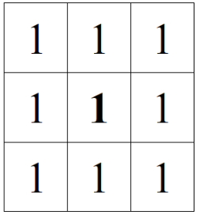

## FIT - Universidad Católica del Uruguay

## Programación II

# Composición y delegación - Pipes & Filters

Esta librería implementa un patrón conocido como **Pipes & Filters**. Esta arquitectura de software consta de dividir tareas complejas en tareas más pequeñas y sencillas que pueden ser ejecutas en serie o paralelo: https://docs.microsoft.com/en-us/azure/architecture/patterns/pipes-and-filters.

En este caso particular, utilizaremos el patrón de Pipes & Filters aplicado a imagenes y modificaciones aplicadas a ellas (filtros).

## Estructura de la librería

Haremos uso de algunas librerias externas para hacer funcionar este programa. Utilizaremos las librerías de TwitterApi (https://github.com/ucudal/PII_TwitterApi) y CognitiveApi (https://github.com/ucudal/PII_CognitiveAPI).

Esta vez, para que no pierdas tiempo con las referencias, ¡ya te damos todo resuelto! Esta librería ya hace referencia a las dos anteriores mencionadas y todo debería funcionar sin que hagas ningún cambio. La única restricción es que todos los repos clonados de github se encuentren en carpetas "hermanas". Por ejemplo, podrias estructurar tus carpetas de la siguiente forma:

```
C:
|->repos
    |->PII_Pipes_Filters
    |->PII_Twitter_Api
    |->PII_CognitiveApi
```

## Ejercicio 1

Observa el siguiente diagrama de secuencia:


Aqui se puede observar cómo una imgen es enviada al primer tramo del pipe y se le aplica un filtro. Luego, esa imagen filtrada, es enviada al siguiente tramo de pipe donde se le aplica un segundo filtro. Finalmente, la imagen es enviada a un PipeNull, el cual no hace nada y finaliza la secuencia.

Tu primer desafío será... ¡reflejar en código esta secuencia! Para ello te damos este proyecto, el cual contiene un program vacio para que programes el ejemplo. No debería ser necesario agregar nuevas clases para completar este desafío, los pipes y los filters del diagrama ya están implementados.

Ten en cuenta que para crear un pipe necesitas el pipe siguiente -y el filtro entre ellos- por lo que deberás crear
los pipes en el orden inverso al que aparecen en la imgen..

Para poder utlizar esta librería, se debe primer cargar una imagen en un IPicture:

```c#
PictureProvider provider = new PictureProvider();
IPicture picture = p.GetPicture(@"PathToImageToLoad.jpg");
```

Luego, se deberán generar una serie de Pipes & Filters para transformar la imagen. Finalmente, se deberá guardar una copia de la imagen mediante el siguiente código:


```c#
PictureProvider provider = new PictureProvider();
provider.SavePicture(image, @"PathToImageToSave.jpg");
```

## Ejercicio 2

En el primer ejercicio, pudimos ver cómo utilizar Pipes & Filters para aplicar una serie de transformaciones secuenciales sobre una imagen. El problema es que no vimos el resultado en ningún lado ya que no guardamos la imagen transformada!

Para ello, vamos a tener que hacer 2 cosas. En primer lugar, necesitamos alguna forma de poder persistir un IPicture al disco. Podremos nuevamente utilizar el PictureProvider para esto:

```c#
PictureProvider p = new PictureProvider();
IPicture pic = p.SavePicture("PathToNewImage.jpg");
```

Ahora que ya sabemos utilizar el PictureProvider para guardar imagenes, podemos almacenar el resultado de la misma para ver como quedó.

Pero... ¿que tal si queremos ver los diferentes pasos de la transformación? Deberiamos entonces poder utilizar esto en nuestra secuencia de pipes & filters. ¿Cómo haremos eso?

¿Qué tal si consideramos el persistir una imagen, como un filtro más? En definitiva, esto no es mas que una transformación sobre un IPicture al igual que los demas IFilters, ¿no?

Tu segundo desafío será implementar esta funcionalidad de persistencia de imagenes, de forma tal que puedas almacenar el resultado de la secuencia en cualquiera de sus pasos intermedios.

## Ejercicio 3

Ahora que ya tenemos una forma de aplicar filtros en secuencia y podemos verificar cómo estos se ven de forma local, ¡queremos poder mostrar al mundo nuestro arte! ¿Qué sentido tiene ser creativos si no podemos mostrarlo públicamente?

Para ello, tu siguiente desafío será publicar en Twitter las imagenes transformadas. Cómo ya vimos en el desafío anterior, esto también podría ser considerado una transformación sobre la IPicture. Deberás entonces encotrar una solución que permita publicar en Twitter el resultado de una secuencia de transformaciones en cualquiera de sus pasos intermedios.

## Ejercicio 4

Hasta ahora hemos realizado secuencias seriales de transformaciones. ¿Qué tal si queremos en algunos casos aplicar una transformación y en otros casos otra? Deberiamos para esto determinar en que casos realizar una acción y en qué casos otra.

¿Qué tal si nuestro IFiltro tuviese un resultado de su ejecución? Un valor lógico en una propiedad por ejemplo. Podriamos llamar a este tipo de filtro un "filtro condicional". Si tuviesemos esto podriamos, ahora sí, crear un tipo de Pipe que envia por una secuencia en caso verdadero y por otra en caso falso. Sería algo así como un "Pipe condicional con bifurcacion" ... ¡seguramente puedas pensar un mejor nombre para esto! 😉

Tu siguiente desafío será entonces crear un filtro nuevo, el cual tenga un resultado de ejecución utlilizando la CognitiveApi. Si la imagen filtrada contiene una cara, el resultado será ```true```, de lo contrario ```false```. Luego implementa un "pipe condicional con bifurcacion", el cual aplica un filtro a la imagen si esta contiene una cara y otro filtro diferente si no contiene una cara.

Aquí tienes un diagrama de secuencia que ilustra esto:


## ¡Ejercicio bonus!

Uno de los filtros implementados aqui es un filtro de convolución. Los filtros de convolución son una familia de filtros
sencillos que calculan el color de un pixel en base al color de los pixels vecinos (https://en.wikipedia.org/wiki/Kernel_(image_processing)).

Por ejemplo, un filtro de convolución es el suavizado, que permite hacer una imagen más borrosa, simplemente tomando como el color de cada pixel el promedio del color de los pixels vecinos. De esta forma, cada uno de los pixels se parece más a sus vecinos, y la imagen se vuelve más borrosa.

Para aplicar un filtro de convolución, se puede utilizar una matriz de 3x3, donde en cada elemento de la matriz es un coeficiente por el cual se debe multiplicar al color del vecino, un divisor y un complemento.

Por ejemplo, para un posible filtro de suavizado, se puede utilizar una matriz (m) como:



```c#
rojo_nuevo[x, y] =
(
    (
        r[x - 1, y - 1] * m[0, 0] + r[x, y - 1] * m[0, 1] + r[x + 1, y – 1] * m[0, 2] +
        r[x - 1, y] * m[1, 0] + r[x, y] * m[1, 1] + r[x + 1, y] * m[1, 2] +
        r[x - 1, y + 1] * m[2, 0] + r[x, y + 1] * m[2, 1] + r[x + 1, y + 1] * m[2, 2]
    ) / divisor
) + complemento
```

Donde ``` r[x,y] ``` corresponde al componente rojo del pixel (x,y) de la imagen original y ```m[i,j]``` al
valor de la matriz en la posición (i,j), donde ```0 <= i``` , ```j <= 2``` . Es decir, el coeficiente del centro
es el peso del pixel que se está filtrando, y el resto el peso de todos los pixels que lo rodean.
En el caso del suavizado, sería:
```c#
rojo_nuevo[x, y] =
(
    (
        r[x-1,y-1] * 1 + r[x,y-1] * 1 + r[x+1,y-1] * 1 +
        r[x-1,y] * 1 + r[x,y] * 1 + r[x+1,y] * 1 +
        r[x-1,y+1] * 1 + r[x,y+1] * 1 + r[x+1,y+1] * 1
) / 9) + 0
```
Lo que equivale a hacer un promedio del valor del componente rojo para cada uno de los
pixels.

El resultado final sería así:
 => 

En esta libreria, ya tienes una implementación de este mismo filtro, pero esta es una solución muy rústica ya que solamente implementa una matriz. Que tal si quiero implmentar otros filtros de convolución para aplicar sobre mis imágenes?

Tu último desafío, será idear una solución que permita de forma sencilla crear nuevos filtros de convolución haciendo uso de las técnicas de reutilización de código vistas hasta ahora.
